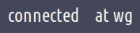
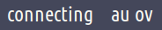

# Script: vpn-mullvad

A script that toggles Mullvad VPN connection with `mullvad` command line client and shows the connection status.

With the module configuration shown below, right-click triggers a reconnect and left-click toggles the connection state.

Optionally, in a second polybar module, some tunnel details like the location of the VPN server currently connected to, as well as the used tunnel protocol can be viewed and changed.
The location is just the country shortcode if only the country was set and city and country shortcodes if city was set.

With the module configuration shown below, scrolling cycles through available server locations by country and left-click toggles the tunnel protocol (WireGuard, OpenVPN).

By default the status shown are the tunnel details, but it can be configured to only show the location (`--location`) or only the protocol (`--protocol`).





## Module

```ini
[module/vpn-mullvad-status]
type = custom/script
exec = ~/polybar-scripts/vpn-mullvad.sh --status
click-left = ~/polybar-scripts/vpn-mullvad.sh --toggle
click-right = ~/polybar-scripts/vpn-mullvad.sh --reconnect
interval = 1

;; _-_-_-_-_-_-_-_-_-_-_-_-_-_-_-_-_-_-_-_-_-_

[module/vpn-mullvad-tunnel]
type = custom/script
exec = ~/polybar-scripts/vpn-mullvad.sh --tunnel-details
click-left = ~/polybar-scripts/vpn-mullvad.sh --toggle-protocol
scroll-up = ~/polybar-scripts/vpn-mullvad.sh --previous
scroll-down = ~/polybar-scripts/vpn-mullvad.sh --next
interval = 1
```
